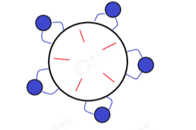
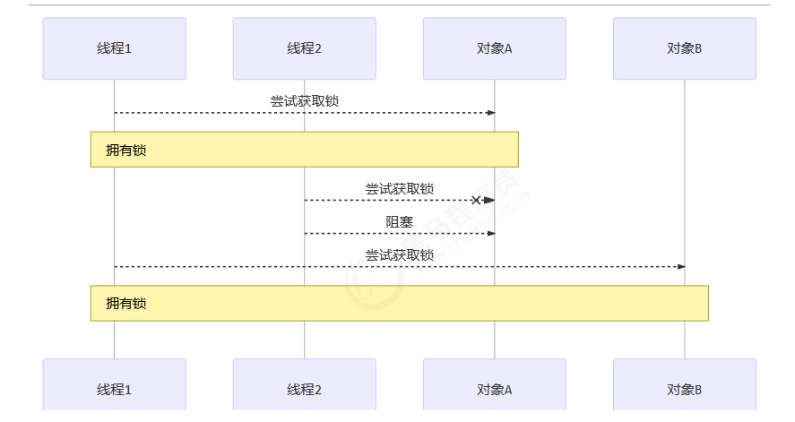

# 活跃性

活跃性相关的一系列问题都可以用ReentrantLock进行解决

## 死锁

有一种情况：一个线程需要同时获得多把锁，这时就容易发生死锁 : t1线程获得 A 对象锁，接下来想获得 B 对象锁； t2 线程获得 B 对象锁，接下来想获得 A 对象的锁

## 检测死锁

检测死锁可以使用 jconsole工具； 或者利用 jps 定位线程id ，再用 jstack 定位死锁

## 哲学家就餐问题

有五位哲学家，围坐在圆桌旁。 他们只做两件事，思考和吃饭，思考一会吃口饭，吃完饭后接着思考。 吃饭时要用两根筷子吃，桌上共有 5 根筷子，每位哲学家左右手边各有一根筷子。 如果筷子被身边的人拿着，自己就得等待。

当每个哲学家即线程持有一根筷子时，他们都在等待另一个线程释放锁，因此造成了死锁。这种线程没有按预期结束，执行不下去的情况，归类为【活跃性】问题，除了死锁以外，还有活锁和饥饿者两

种情况

## 饥饿

很多教程把饥饿定义为：一个线程由于优先级太低，始终得不到CPU调度执行，也不能够结束。

死锁的情况：

顺序加锁的解决方案：

