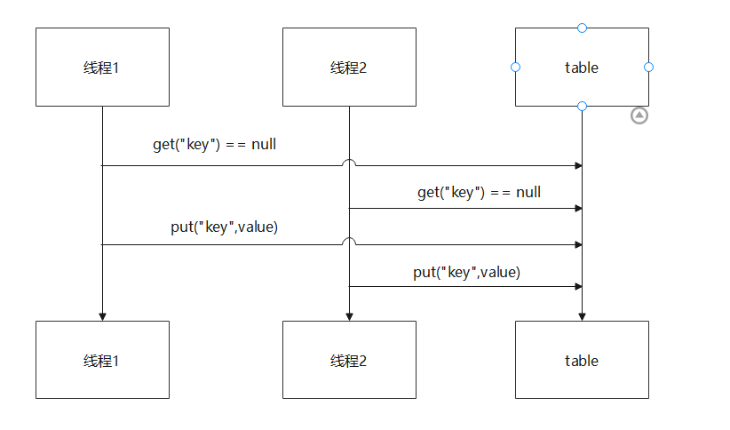

# 临界区

多个线程对共享区域进行操作，这片区域就被称为是临界区。

# 问题

临界区存在线程安全问题：

```java
	static int counter = 0;

    public static void main(String[] args) {
        Thread thread1 = new Thread(() -> {
            for (int j = 0; j < 99999; j++) {
                counter++;
            }
        });

        Thread thread2 = new Thread(() -> {
            for (int i = 0; i < 99999; i++) {
                counter--;
            }
        });

        thread1.start();
        thread2.start();

        try {
            thread1.join();
            thread2.join();
        } catch (InterruptedException e) {
            e.printStackTrace();
        }

        System.out.println(counter);
    }
```

程序运行结果：


结果是随机的，按照程序设计的本意应该是为0，但实际得不到这个结果。

# synchronized

```java
synchronized(对象){
   临界区
}
```


## synchronized解决线程安全问题

```java
	static int counter = 0;

    static final Object obj = new Object();

    public static void main(String[] args) {
        Thread thread1 = new Thread(() -> {
            for (int j = 0; j < 99999; j++) {
                synchronized (obj) {
                    counter++;
                }
            }
        });

        Thread thread2 = new Thread(() -> {
            for (int i = 0; i < 99999; i++) {
                synchronized (obj) {
                    counter--;
                }
            }
        });

        thread1.start();
        thread2.start();

        try {
            thread1.join();
            thread2.join();
        } catch (InterruptedException e) {
            e.printStackTrace();
        }

        System.out.println(counter);
    }
```

此时运行结果无论如何都是 **0** .

## synchronized理解

- synchronized(对象)中的对象，可以想象成一个房间(room)，有唯一入口(门)房间只能一次进入一个人进行计算，线程t1,t2想象成两个人
- 当线程t1执行到synchronized(room)时就好比t1进入了房间，并锁住了门拿走钥匙，在门内执行count++代码
- 这时如果t2也运行到了synchronized(room)时，发现门被锁住了，只能在门外等待，发生了上下文切换，阻塞住了
- 这中间即使t1的cpu时间片不幸用完，被踢出了门外(不要错误理解为锁住了对象就能一直执行下去)，这时门还是锁住的，t1仍拿着钥匙，t2线程还在阻塞状态进不来，只有下次轮到t1自己再次获得时间片时才能开门进入
- 当t1执行完synchronized{}块内的代码，这时候才会从obj房间出来并解开门上的锁，唤醒t2线程并把钥匙给他。t2线程这时才能进入obj房间，锁住了门拿上钥匙，执行它的count--代码

## synchronized面向对象的改进

```java
class Room {
    private int counter;

    public void increment() {
        synchronized (this) {
            counter++;
        }
    }

    public void decrement() {
        synchronized (this) {
            counter--;
        }
    }

    public int getCounter() {
        synchronized (this) {
            return counter;
        }
    }
}
```

## synchronized方法

```java
public synchronized void increment(){
	...
}
```

相当于

```java
public void increment(){
	synchronized(this){
		...
	}
}
```

这样的方式都是锁住的实例对象。

**注意：synchronized修饰的如果是static方法，则锁住的是所在的Class对象**

## 线程"八锁"问题

略

## 变量的线程安全分析

### 成员变量和静态变量的线程安全分析

- 如果没有变量在线程之间共享，那么变量是安全的
- 如果变量在线程之间共享：
  - 如果只有读操作，那么变量安全
  - 如果有读写操作，则这段代码是临界区，需要考虑线程安全

### 局部变量线程安全分析

- 局部变量是基本数据类型的，则是安全的
- 局部变量引用的对象未必是安全的
  - 如果局部变量引用的对象没有引用线程共享的对象，那么是线程安全的
  - 如果局部变量引用的对象引用了一个线程共享的对象，那么要考虑线程安全

### 线程安全的情况

```java
public static void test(){
	int i = 10;
    i++
}
```

每个线程调用test()方法时，局部变量i，会在每个线程的栈帧中被创建多份，因此不存在共享


### 线程不安全的情况

```java
public class Test15 {
    public static void main(String[] args) {
        UnsafeTest unsafeTest = new UnsafeTest();
        for (int i = 0; i < 100; i++) {
            new Thread(() -> {
                unsafeTest.method1();
            }).start();
        }
    }
}

class UnsafeTest {
    ArrayList<String> arrayList = new ArrayList<>();

    public void method1() {
        for (int i = 0; i < 100; i++) {
            method2();
            method3();
        }
    }

    public void method2() {
        arrayList.add("1");
    }

    public void method3() {
        arrayList.remove(0);
    }
}
```

解决方法，将arrayList改为成员变量，就可以解决线程安全问题了：

```java
class SafeTest {
    public void method1() {
        ArrayList<String> arrayList = new ArrayList<>();
        for (int i = 0; i < 100; i++) {
            method2(arrayList);
            method3(arrayList);
        }
    }

    public void method2(ArrayList arrayList) {
        arrayList.add("1");
    }

    public void method3(ArrayList arrayList) {
        arrayList.remove(0);
    }
}
```

## 常见线程安全类

1. String
2. Integer
3. StringBuffer
4. Random
5. Vector
6. Hashtable
7. java.util.concurrent包下的类

这里的线程安全指的是，多个线程调用它们的同一个实例的某个方法时，是线程安全的。也可以理解它们的每个方法是原子的

但需要注意的是，它们多个方法的组合不是原子的，见下面分析：

```java
Hashtable table = new Hashtable();
if(table.get("key")==null){
	table.put("key",value);
}
```

	

### 不可变类的线程安全

String 和 Integer 类都是不可变的类，因为其类内部状态是不可改变的，因此他们的方法都是线程安全的。


## 示例分析-是否线程安全

示例一

下面这个示例是线程不安全的，MyAspect切面类只有一个实例，成员变量start会被多个线程同时读写操作

```java
@Aspect
@Component
public class MyAspect {
    // 是否线程安全
    private long start = 0l;

    public void before() {
        start = System.nanoTime();
    }

    public void after() {
        long end = System.nanoTime();
        System.out.println("cost time: " + (end - start));
    }
}
```

示例二

`MyServlet` `UserServiceImpl` `UserDaoImpl`类都只有一个实例，`UserDaoImpl`类中没有成员变量，`update`方法里的变量引用的对象不是线程共享的，所以是线程安全的；`UserServiceImpl`类中只有一个线程安全的`UserDaoImpl`类的实例，那么`UserServiceImpl`类也是线程安全的，同理 `MyServlet`也是线程安全的

```java
public class MyServlet extends HttpServlet {
    // 是否安全
    private UserService userService = new UserServiceImpl();

    public void doGet(HttpServletRequest request, HttpServletResponse response) {
        userService.update();
    }
}

class UserServiceImpl implements UserService {
    // 是否安全
    private UserDao userDao = new UserDaoImpl();

    public void update() {
        userDao.update();
    }
}

interface UserService {
    void update();
}

class UserDaoImpl implements UserDao {
    public void update() {
        String sql = "update user set password = ? where username = ?";
        // 是否安全
        try (Connection connection = DriverManager.getConnection("", "", "")) {
            // ...
        } catch (Exception e) {
            // ...
        }
    }
}

interface UserDao {
    void update();
}
```

示例三

在userDaoImpl中有成员变量，那么多个线程可以对成员变量进行操作，所以不是线程安全的

```java
public class MyServlet extends HttpServlet {
    // 是否安全
    private UserService userService = new UserServiceImpl();

    public void doGet(HttpServletRequest request, HttpServletResponse response) {
        userService.update(...);
    }
}

public class UserServiceImpl implements UserService {
    // 是否安全
    private UserDao userDao = new UserDaoImpl();

    public void update() {
        userDao.update();
    }
}

public class UserDaoImpl implements UserDao {
    // 是否安全
    private Connection conn = null;

    public void update() throws SQLException {
        String sql = "update user set password = ? where username = ?";
        conn = DriverManager.getConnection("", "", "");
        // ...
        conn.close();
    }
}
```

示例四

每个线程访问时，都会新建一个userDao对象，新建的对象是线程独有的，所以是线程安全的

```java
public class MyServlet extends HttpServlet {
    // 是否安全
    private UserService userService = new UserServiceImpl();
    public void doGet(HttpServletRequest request, HttpServletResponse response) {
        userService.update(...);
    }
}
public class UserServiceImpl implements UserService {
    public void update() {
        UserDao userDao = new UserDaoImpl();
        userDao.update();
    }
}
public class UserDaoImpl implements UserDao {
    // 是否安全
    private Connection = null;
    public void update() throws SQLException {
        String sql = "update user set password = ? where username = ?";
        conn = DriverManager.getConnection("","","");
        // ...
        conn.close();
    }
}
```

示例五

```java
public abstract class Test {
    public void bar() {
        // 是否安全
        SimpleDateFormat sdf = new SimpleDateFormat("yyyy-MM-dd HH:mm:ss");
        foo(sdf);
    }
    public abstract foo(SimpleDateFormat sdf);
    public static void main(String[] args) {
        new Test().bar();
    }
}
```

其中foo方法是不确定的，可能导致不安全的发生，被称之为**外星方法**，因为foo方法可以被重写，导致线程不安全。在String类中就考虑到了这一点，String类是finally的，子类不能重写它的方法。

# Monitor

## Monitor原理

Monitor被翻译称为监视器或管程。

每个java对象都可以关联一个Monitor，如果使用synchronized给对象上锁(重量级)，该对象头上的MarkWord就被设置为指向Monitor对象的指针。

- 刚开始时，Monitor的owner为空
- 当thread-1执行synchronized(obj){}代码时，会将Monitor的owner设置为thread1，上锁成功后，Monitor中同一时刻只能有一个owner
- 当thread-1占据锁时，如果thread2和thread3也执行到synchronized(obj){}时，就会进入到EntryList中，变成Blocked状态
- 当thread-1执行完同步代码后，然后唤醒entryList中等待的线程来竞争，竞争时是非公平的
- waitset中的thread4和thread5是之前获得过锁，但条件不满足进入waiting状态的线程，后面讲wait-notify时会分析


# synchronized原理进阶

## 轻量级锁

使用场景：如果一个对象虽然有多个线程要对它进行加锁，但是加锁的时间是错开的，那么可以使用轻量级锁来进行优化。轻量级锁对用户来说是透明的，语法仍然是synchronized，假设有两个方法同步块，利用同一个对象加锁

```java
static final Object obj = new Object();
public static void method1(){
	synchronized(obj){
		// 同步块A
		method2();
	}
}

public static void method2(){
	synchronized(obj){
	
	}
}
```

1. 每次执行到synchronized代码块时，都会创建锁记录(Lock Record)对象，每个线程都会记录一个锁记录的结构，锁记录内部可以储存对象的Mark Word和对象引用reference.


2. 让锁记录中的Object refernce指向对象，并且尝试使用cas替换Object对象的Mark Word，将Mark Word的值存入锁记录中。


3. 如果cas替换成功，那么对象的对象头存储的就是锁记录的地址和状态01，如下所示

   

4. 如果cas失败，有两种情况：

   1. 如果是其他线程已经持有了Object的轻量级锁，那么表示有竞争，将进入锁膨胀状态
   2. 如果是自己的线程已经执行了synchronized进行加锁，那么再添加一条锁记录Lock Record作为重入的计数

   

5. 当线程退出synchronized代码块的时候，如果获取的取值是null的锁记录，表示有重入，这时重置锁记录，表示重入计数减一


6. 当线程退出synchronized代码块时，如果获取的锁记录取值不为null，那么使用cas将Mark word的值恢复给对象
   1. 成功则解锁成功
   2. 失败，则说明轻量级锁进行了锁膨胀或已经升级为重量级锁，进入重量级锁解锁流程

## 锁膨胀

如果在尝试加轻量级锁的过程中，cas操作无法成功，这是有一种情况就是其它线程已经为这个对象加上了轻量级锁，这时就要进行锁膨胀，将轻量级锁变成重量级锁

1. 当thread-1进行轻量级加锁时，thread-0已经对该对象加了轻量级锁

   

2. 这时thread-1加轻量级锁失败，进入锁膨胀流程

   1. 即为对象申请Monitor锁，让Object指向重量级锁地址，然后自己进入Monitor的EntryList变成BLOCKED状态

   

   

3. 当thread-0退出synchronized代码块时，使用cas将Mark Word的值恢复给对象头，那么会进入重量级锁的解锁过程，即按照Monitor的地址找到Monitor对象，将Owner对象置为null，唤醒EntryList的thread线程

## 偏向锁

在轻量级锁中，我们可以发现，如果同一个线程对同一个2对象进行重入锁时，也需要执行CAS操作，这是有点耗时的，在java6中开始引入偏向锁的概念，只有第一次使用CAS时将对象的Mark Word头设置为入锁线程id，之后这个入锁线程再进行重入锁时，发现线程ID是自己，那么就不再进行CAS了
