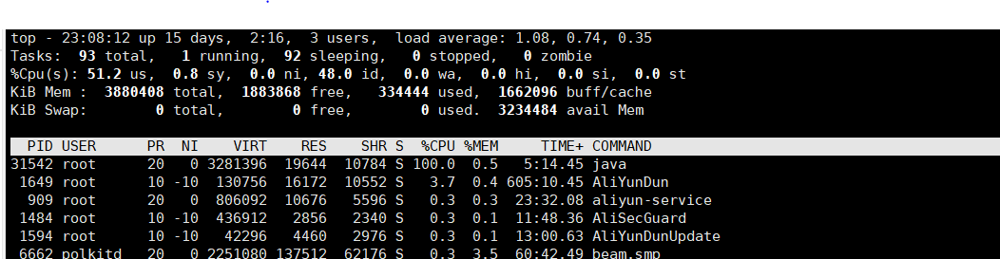
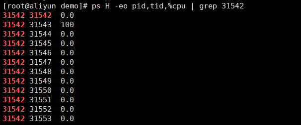
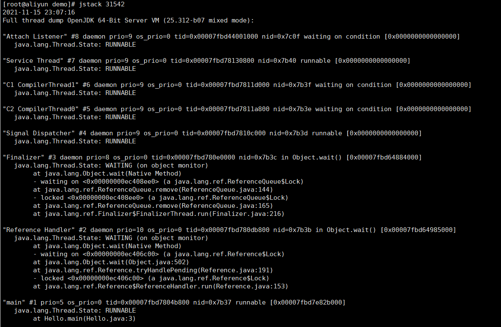
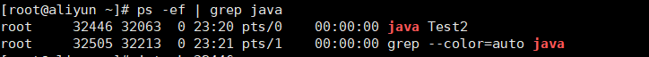
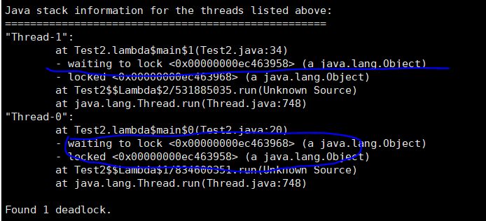
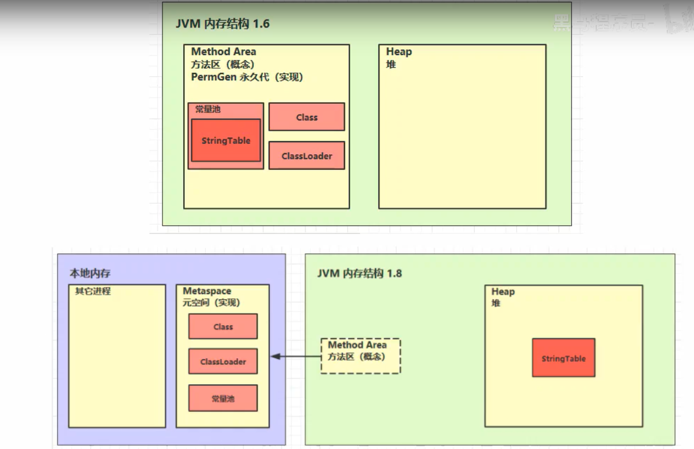

# 内存结构

## 1. 程序计数器

### 1.1 定义

程序计数器，Program Counter Register 

### 1.2 作用

- 存储jvm下一条指令的地址
- 线程私有
- 不会存在内存溢出

## 2. 虚拟机栈

### 2.1 定义

Java Virtual Machine Stacks (Java虚拟机栈)

- 每个线程运行时所需要的内存，称为虚拟机栈
- 每个栈由多个栈帧构成，对应着每次方法调用时所占用的内存
- 每个线程只能存在一个活动帧，对应着正在执行的那个方法

问题辨析

1. 垃圾回收是否涉及栈内存？

   不涉及，方法执行完，栈帧就立即释放出来

2. 栈内存分配越大越好？

   栈内存可以通过Xss来设置。

   否。假设物理内存为100M，一个栈内存分配给1M，理论上可以存在有100个线程

3. 方法内的局部变量是否线程安全？

   - 如果方法局部变量没有逃离方法的作用范围，它是线程安全的
   - 如果是局部变量引用了对象，并逃离方法的作用方法，需要考虑线程安全

### 2.2 栈内存溢出

- 栈帧过多导致栈内存溢出
- 栈帧过大导致内存溢出（不太容易出现）

栈内存代码示例：StackOverFlowError

```java
public class Test1 {

    private static int count;

    public static void main(String[] args) {
        try {
            method1();
        } catch (Throwable e) {
            e.printStackTrace();
            System.out.println(count);
        }
    }

    public static void method1() {
        count++;
        method1();
    }

}

```

### 2.3 线程运行诊断

案例1： cpu占用过多

定位

- 用top定位哪个进程对cpu的占用过高

  

- ps H -eo pid,tid,%cpu | grep 进程id（用ps命令进一步定位是哪个线程引起的cpu占用过高）

  

- jstack进程id

  - 可以根据线程id找到有问题的线程，进一步定位到问题代码的源码行号

  


案例2： 程序运行很长时间都未出现结果

- ps -ef | grep java 查看java进程



- jstack 进程号 查看是否存在死锁




- 与源码对应

  

## 3. 本地方法栈

java可以调用底层一些方法native，本地方法栈就是分配给本地方法的内存。

## 4. 堆

### 4.1 定义

Heap堆

- 通过new关键字，创建对象都会使用到堆内存

特点

- 它是线程共享的，堆中的对象都需要考虑到线程安全问题
- 有垃圾回收机制

### 4.2 堆内存溢出

```java
import java.util.ArrayList;
import java.util.List;

public class Test3 {
    public static void main(String[] args) {
        List<String> list = new ArrayList<>();
        while (true) {
            list.add("Hello");
        }
    }
}
```

出现异常：

```java
Exception in thread "main" java.lang.OutOfMemoryError: Java 堆空间
	at java.util.Arrays.copyOf(Arrays.java:3210)
	at java.util.Arrays.copyOf(Arrays.java:3181)
	at java.util.ArrayList.grow(ArrayList.java:267)
	at java.util.ArrayList.ensureExplicitCapacity(ArrayList.java:241)
	at java.util.ArrayList.ensureCapacityInternal(ArrayList.java:233)
	at java.util.ArrayList.add(ArrayList.java:464)
	at com.mylearn.jvm.Test3.main(Test3.java:11)
```

### 4.3 堆内存诊断

1. jps工具

   - 查看当前系统有哪些java进程

2. jmap工具

   - 查看堆内存占用情况: jmap -heap 进程id

3. jconsole工具

   - 图形界面，多功能的监测工具，可以连续检测

4. jvitualvm

   可以使用jvitualvm将某个时刻下的java内存使用dump进行快照保存下来，接下来可以分析出dump文件中的占用内存大的对象。	

## 5.方法区

### 5.1 定义

### 5.2 组成

常量池为运行时常量池



### 5.3 方法区内存溢出

- 1.8以前会导致永久代内存溢出

  永久代内存溢出： java.lang.OutofMemoryError: PermGen space

  -XX:MaxPermSize=8m

- 1.8之后会导致元空间内存溢出

  元空间内存溢出： java.lang.OutofMemoryError: Metaspace

  -XX:MaxMetaspaceSize=8m

场景（方法区内存溢出）：

- spring
- mybatis

### 5.4 运行时常量池

- 常量池，就是一张表，虚拟机根据这张常量表找到要执行的类名、方法名、参数类型、字面量等信息
- 运行时常量池，常量池是*.class文件中的，当该类被加载，它的常量池信息就会被放到运行时常量池，并把里面的符号地址变为真实地址

### 5.5 StringTable

```java
// StringTable [ "a"，"b" ,"ab" ] hashtable结构，不能扩容
public class Test5 {
    // 常量池中的信息，都会被加载到运行时常量池中，这时 a b ab 都是常量池中的符号，还没有变为java字符串对象
    // ldc #2 会把a符号变为“a”字符串对象
    // ldc #3 会把b符号变为"b"字符串对象
    // ldc #4 会把ab符号作为"ab"字符串对象

    public static void main(String[] args) {
        String s1 = "a";
        String s2 = "b";
        String s3 = "ab";

        // 反编译得到实际运行过程：new StringBuilder().append("a").append("b").toString()
        // 创建了一个新对象存入了s4对象中
        String s4 = s1 + s2;
        System.out.println(s3 == s4);

        // javac在编译期间，结果在编译期间已经确定为ab
        String s5 = "a" + "b";
        System.out.println(s3 == s5);
        System.out.println(s4 == s5);

    }

}
```


```java
public class Test6 {
    public static void main(String[] args) {
        System.out.println();

        // 执行1行，创建1个字符串对象
        System.out.println("1");
        System.out.println("2");
        System.out.println("3");
        System.out.println("4");
        System.out.println("5");
        System.out.println("6");
        System.out.println("7");
        System.out.println("8");
        System.out.println("9");
        System.out.println("0");

        // 下面代码执行，并不会增加新的内存，因为在上面代码中已经创建了相应的字符串对象
        System.out.println("1");
        System.out.println("2");
        System.out.println("3");
        System.out.println("4");
        System.out.println("5");
        System.out.println("6");
        System.out.println("7");
        System.out.println("8");
        System.out.println("9");
        System.out.println("0");

    }
}
```

### 5.6 StringTable特性

- 常量池中的字符串仅是符号，第一次用到时才会变为对象

- 利用串池的机制，来避免重复创建字符串对象

- 字符串变量拼接的原理是StringBuilder

- 字符串常量拼接的原理是编译期优化

- 可以使用intern方法，主动将串池中还没有的字符串对象放入串池

  - 1.8调用intern方法，将字符串放入串池中，如果有则不放，没有则放入
  - 将字符串放入串池中，如果有则不放，没有则复制一个新对象

  intern代码案例：

  ```java
  public class Test7 {
  
      public static void main(String[] args) {
          String x = "ab"; // 创建一个字符串，放在了常量池中
  
          String s = new String("a") + new String("b"); // s是一个对象，放在堆中
          System.out.println(x == s); // false
  
          String s2 = s.intern(); // intern方法，将这个字符串对象尝试放入串池中，如果有则不放入，没有则把串池中对象返回
          System.out.println(x == s2);    // true
          System.out.println(s == s2);    // false
      }
  
  }
  ```

  ```java
  public class Test8 {
  
      public static void main(String[] args) {
          String s = new String("a") + new String("b");
  
          // 堆 new String("a") new String("b") new String("ab")
          String s2 = s.intern(); // 将这个字符串对象尝试放入串池，如果有则并不会放入，如果没有则放入串池，会把串池中对象返回
          System.out.println(s2 == "ab"); // true ,后半部分相当于从串池中取出了"ab"
          System.out.println(s == "ab");  // true ,将s放入了常量池中，那么实际上s和常量池就是同一个对象
      }
  
  }
  ```

### 5.7 StringTable的位置

- jdk1.8版本中，stringtable在堆内存
- jdk1.6中，Stringtable在永久代中

### 5.8 StringTable 垃圾回收

当堆内存中字符串数量达到一定量，内存紧张时，会触发垃圾回收

### 5.9 StringTable 性能调优

- 调整 -XX:StringTableSize=桶个数

- 考虑将字符串对象是否入池

  如果系统中存在很多字符串值相同，可以放入串池中

## 6. 直接内存

### 6.1 定义

Direct Memory

- 常见于NIO操作，用于数据缓冲区
- 分配回收成本较高，但读写性能高
- 不受jvm内存回收管理

### 6.2 分配和回收原理

- 使用了Unsafe对象完成直接内存的分配回收，并且回收需要主动调用freeMemory方法
- ByteBuffer的实现类内部，使用了Cleaner(虚引用)来监测ByteBuffer对象，一旦ByteBuffer对象被垃圾回收，那么就会由ReferenceHandler线程通过Cleaner的clean方法调用freeMomory来释放直接内存


# JVM参数

- -XX:MaxPermSize=9m 设置永久代最大内存为9m

- -Xmx10m 设置最大堆内存为10m

- -XX:-UseGCOverheadLimit 

  UseGCOverheadLimit +启用此模式；-不启用； 

  当启用gcOverheadLimit，如果jvm使用98%的性能只回收了2%的堆内存，则放弃堆内存回收，直接抛出异常

- -XX:StringTableSize=1009 

  设置StringTableSize的桶个数，当系统中String字符串较多时，可以设置StringTableSize值小一点，这样效率会较高

- -XX:+DisableExplicitGC 禁用显示GC
- System.gc() 显示的垃圾回收，full gc


