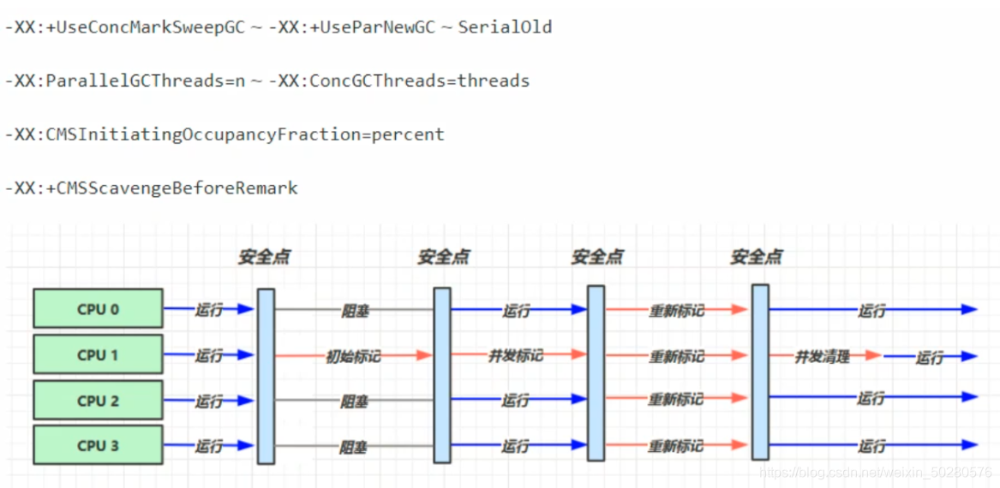
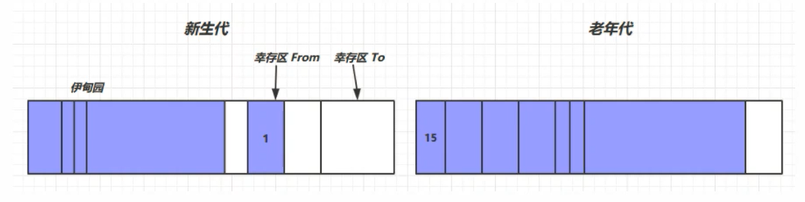
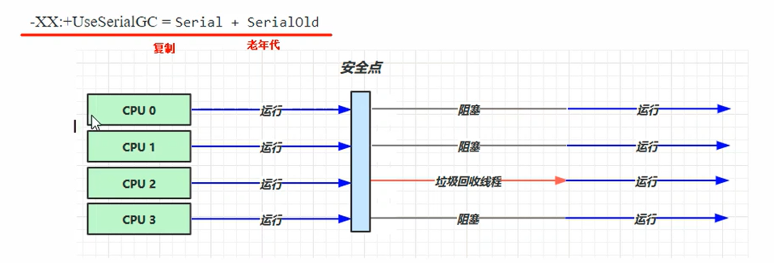
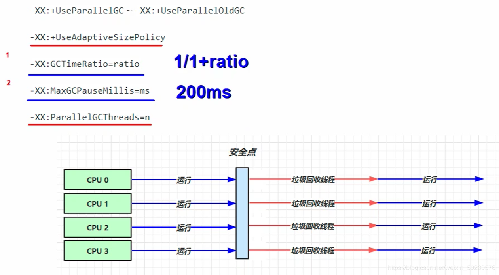
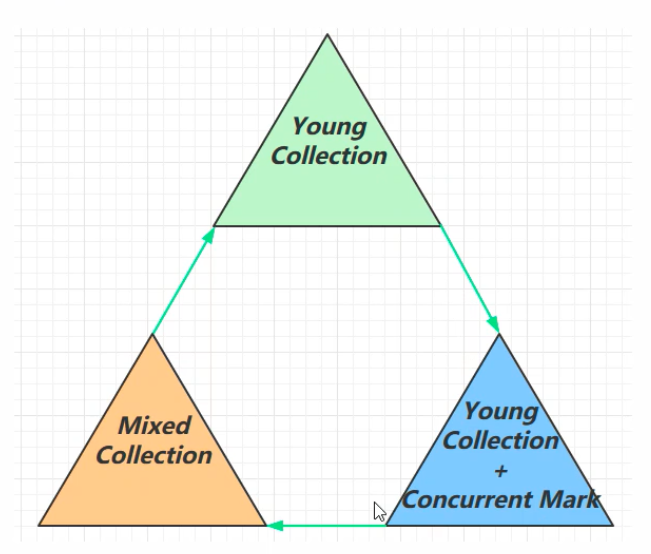
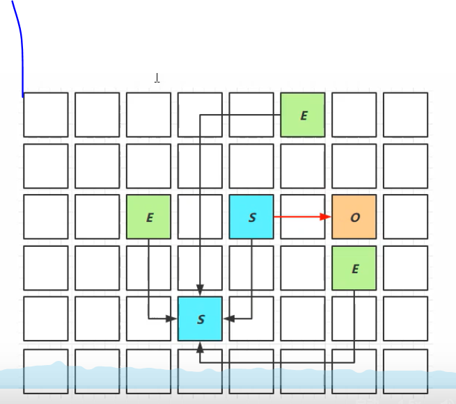
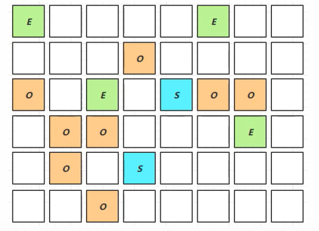
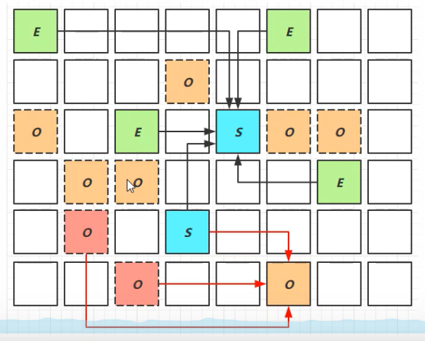

# 垃圾回收

## 1. 如何判断对象可以回收

### 1.1 引用计数器

对象每被引用一次，就计数加1，如果计数为0，则表示没有被引用。

引用计数法存在一个缺陷：A对象引用B对象，B对象引用A对象，产生了循环引用

### 1.2 可达性分析算法

- Java虚拟机中的垃圾回收器采用可达性分析来探索所有存活的对象
- 扫描堆中的对象，看是否能够沿着GC Root对象为起点的引用链找到该对象，找不到，表示可以回收
- 哪些对象可以作为GC Root?
  - 虚拟机栈（栈帧中的本地变量表）中引用的对象
  - 方法区中类静态属性引用的对象
  - 方法区中常量引用的对象
  - 本地方法栈中（即一般是的Native方法）引用的对象

- 强引用、软引用、弱引用的区别
  - 强引用顾名思义
  - 软引用：gc后若内存不够，会回收软引用对象；弱引用：不管内存够不够，gc都会回收
- 虚引用、终结器引用
  - 虚引用Buffer：直接内存，当释放直接内存时，虚引用对象放入到了引用队列，会调用虚引用对象的Unsafe.freeMemory来回收直接内存
  - 终结器引用finallize：当对象被回收后，jvm会给对象创建一个终结器引用并放入到引用队列中，jvm会启动finallize线程在某个时机回收对象

### 1.3 四种引用

1. 强引用
   - 类似 Object obj  = new Object()这样的就是强引用
   - 只有GC Roots对象都不通过【强引用】引用该对象，该对象才能被垃圾回收
2. 软引用（SoftReference）
   - 描述一些还有用但并非必需的对象
   - 仅有软引用引用该对象时，在垃圾回收后，内存仍不足时会再次触发垃圾回收，回收软引用对象
   - 可以配合引用队列来释放引用自身
3. 弱引用（WeakReference）
   - 仅有弱引用引用该对象时，在垃圾回收时，无论内存是否充足，都会回收弱引用对象
   - 可以使用配合引用队列来释放引用自身
4. 虚引用（PhantomReference）
   - 也被称为幽灵引用或幻影引用
   - 为一个对象设置引用关联的唯一目的就是能在这个对象被收集器回收时受到一个系统通知
   - 必须配合引用队列使用，主要配合ByteBuffer使用，被引用对象回收时，会将虚引用入队，由Reference Handler线程调用虚引用相关方法释放直接内存
5. 终结器引用（FinalReference）
   - 无需手动编码，但其内部配合引用队列使用，在垃圾回收时，终结器入队（被引用对象暂时没有被回收），再由Finalizer线程通过终结器引用找到被引用对象并调用它的finalize方法，第二次GC时才能回收被引用对象

代码案例：

https://blog.csdn.net/weixin_50280576/article/details/113775575?spm=1001.2014.3001.5501

## 2. 垃圾回收算法

### 2.1 标记清除法

Mark Sweep

- 速度较快
- 会产生内存碎片



### 2.2 标记整理

Mark Compact

- 让存活的对象向一端移动

- 速度慢

- 没有内存碎片

  

### 2.3 复制

Copy

- 不会有内存碎片

- 需要占用两倍内存空间

  

## 3. 分代垃圾回收



- 新创建的对象首先分配在eden区
- 新生代空间不足时，触发minor gc，eden区和from区存活的对象使用-copy复制到to区，存活的对象年龄加1，然后交换from和to
- minor gc会引发stop the world，暂停其他用户的线程，等垃圾回收结束，用户线程才恢复运行
- 当对象寿命超过阈值时，会晋升到老年代，最大寿命是15次（4bit）
- 当老年代空间不足，会先尝试minor gc，如果之后空间仍然不足，会触发full gc, STW的时间更长
- 若创建出的是大对象，新生代无法容纳大对象，则直接放入到老年代

### 3.1 相关JVM参数

| 含义               | 参数                                                         |
| ------------------ | ------------------------------------------------------------ |
| 堆初始大小         | -Xms                                                         |
| 堆最大大小         | -Xmx, -XX:MaxHeapSize=size                                   |
| 新生代大小         | -Xmn, -XX:NewSize=size +-XX:MaxNewSize=size                  |
| 幸存区比例（动态） | -XX:InitialSurvivorRatio=ratio 和 -XX:+UseAdaptiveSizePolicy |
| 幸存区比例         | -XX:SurvivorRatio=ratio                                      |
| 晋升阈值           | -XX:MaxTenuringThreshold=threshold                           |
| 晋升详情           | -XX:+PrintTenuringDistribution                               |
| GC详情             | -XX:+PrintGCDetails -verbose:gc                              |
| FullGC 前 MinorGC  | -XX:+ScavengeBeforeFullGC                                    |

### 3.2 GC分析

```java
import java.util.ArrayList;
import java.util.List;

public class Test10 {

    private static final int _512KB = 512 * 1024;
    private static final int _1MB = 1024 * 1024;
    private static final int _6MB = 6 * 1024 * 1024;
    private static final int _7MB = 7 * 1024 * 1024;
    private static final int _8MB = 8 * 1024 * 1024;

    // -Xms20m -Xmx20m -Xmn10m -XX:+UseSerialGC -XX:+PrintGCDetails -verbose:gc
    public static void main(String[] args) {
        List<byte[]> list = new ArrayList<>();
        list.add(new byte[_6MB]);
        list.add(new byte[_512KB]);
        list.add(new byte[_6MB]);
        list.add(new byte[_512KB]);
        list.add(new byte[_6MB]);
    }

}
```

可以通过上述程序，给list分配内存，来观察 老年代 和 新生代 的情况，什么时候触发minor gc，什么时候触发full gc等情况，使用前先设置jvm参数

### 3.3 线程OOM不会影响进程

```java
import java.util.ArrayList;
import java.util.concurrent.TimeUnit;

public class Test11 {

    private static final int _512KB = 512 * 1024;
    private static final int _1MB = 1024 * 1024;
    private static final int _6MB = 6 * 1024 * 1024;
    private static final int _7MB = 7 * 1024 * 1024;
    private static final int _8MB = 8 * 1024 * 1024;

    // -Xms20m -Xmx20m -Xmn10m -XX:+UseSerialGC -XX:+PrintGCDetails -verbose:gc
    public static void main(String[] args) {
        new Thread(()->{
            ArrayList<byte[]> list = new ArrayList<>();
            list.add(new byte[_8MB]);
            list.add(new byte[_7MB]);
        }).start();

        System.out.println("sleep...");
        try {
            TimeUnit.SECONDS.sleep(10);
        } catch (InterruptedException e) {
            e.printStackTrace();
        }
    }
}
```

实践证明，线程oom并不会影响到整个java进程，其他线程仍然可以正常运行。

### 3.4 疑惑

from和to区的对象会怎么处理

## 4. 垃圾回收器

### 4.1 串行

- 单线程
- 堆内存较小，适合个人电脑



```
-XX:+UseSerialGC=serial + serialOld
```

安全点：让其他线程在这个点都停下来，以免垃圾回收时移动对象地址，使得其他线程找不到被移动的对象

因为是串行的，所以只有一个垃圾回收线程，且在该线程执行回收工作时，其他线程进入阻塞状态

**Serial收集器**

Serial收集器是最基本的、发展历史最悠久的收集器

特点：单线程、简单高效的（与其他收集器的单线程对比），采用复制算法。对于限定单个CPU的环境来说，Serial收集器由于没有线程交互的开销，专心做垃圾收集自然可以获得最高的单线程收集效率。收集器进行gc时，必须暂停其他所有的工作线程，直到它结束（Stop The World）

**ParNew收集器**
ParNew收集器其实就是Serial收集器的多线程版本

特点：多线程、ParNew收集器默认开启的收集线程数与CPU数量相同，在CPU非常多的环境中，可以使用 -XX:ParallelGCThreads参数来限制垃圾收集的线程。和Serial收集器一样存在Stop the world的问题

**Serial Old收集器**
Serial Old是Serial收集器的老年代版本

特点：同样是单线程收集器，采用**标记-整理**算法

### 4.2 吞吐量优先

- 多线程
- 堆内存较大，多核CPU
- 让单位时间内，SWT的时间变短



```java
-XX:+UseParallelGC ~ -XX:+UsePrallerOldGC
-XX:+UseAdaptiveSizePolicy	动态自适应调整gc线程数
-XX:GCTimeRatio=ratio // 1/(1+radio)
-XX:MaxGCPauseMillis=ms // 200ms
-XX:ParallelGCThreads=n 限制gc线程数
```

**Parallel Scavenge收集器**

与吞吐量关系密切，故也称为吞吐量优先收集器

**特点**：属于新生代收集器也是采用复制算法的收集器（用到了新生代的幸存区），又是并行的多线程收集器（与ParNew收集器类似），该收集器的目标是达到一个可控制的吞吐量。还有一个值得关注的点：gc自适应调节策略（与ParNew收集器最重要的一个区别）

**gc自适应调节策略**: 

Parallel Scavenge收集器可设置 -XX:+UseAdptiveSizePolicy参数

当开关打开时不需要手动指定新生代的大小（-Xmn）、Eden与Survior区的比例（-XX:SurvivorRation）、晋升老年代的对象年龄（-XX:PretenureSizeTheshold）等，虚拟机会根据系统的运行状况收集性能监控信息，动态设置这些参数以提供最优的停顿时间和最高的吞吐量，这种调节方式称为GC的自适应调节策略。

Parallel Scavenge收集器使用两个参数控制吞吐量：

- XX:MaxGCPauseMills=ms 控制最大的垃圾收集停顿时间（默认200ms）
- XX:GCTimeRatio=ratio 直接设置吞吐量的大小

**Parallel Od收集器**

Parallel Scavenge收集器的老年代版本

特点：多线程，采用标记-整理算法（老年代没有幸存区）

### 4.3 响应时间优先

- 多线程
- 堆内存较大，多核CPU
- 尽可能让单次STW的时间变短


```
-XX:+UseConcMarkSweepGC ~ -XX:+UseParNewGC ~ SerialOld
-XX:ParallelGCThreads=n ~ -XX:ConcGCThreads=threads
-XX:CMSInitiatingOccupancyFraction=percent
-XX:+CMSScavengeBeforeRemark
```

**CMS收集器**

Concurrent Mark Sweep，一种以获取最短停顿时间为目标的老年代收集器

**特点**：基于标记-清除算法实现。并发收集、低停顿，但是会产生内存碎片

**应用场景**：适用于注重服务的相应速度，希望系统停顿时间最短，给用户带来更好的体验等场景。如web程序、b/s服务

**CMS收集器的运行过程分为下列4步**：

- 初始标记：标记GC Roots能直接到的对象。速度很快但是仍存在Stop The World的问题
- 并发标记：进行GC Roots Tracing 的过程，找出存活对象且用户线程可并发执行
- 重新标记：为了修正并发标记期间因用户程序继续运行而导致标记产生变动的那一部分对象的标记记录。仍然存在 Stop The World 问题
- 并发清除：对标记的对象进行清除回收，清除的过程中，可能任然会有新的垃圾产生，这些垃圾就叫浮动垃圾，如果当用户需要存入一个很大的对象时，新生代放不下去，老年代由于浮动垃圾过多，就会退化为 serial Old 收集器，将老年代垃圾进行标记-整理，当然这也是很耗费时间的！

`-XX:ParallelGCThreads=n ~ -XX:ConcGCThreads=threads` ParallelGCThreads：并行GC的线程数；ConcGCThreads: 并发GC的线程数，一般设置ParallelGCThreads的1/4。CMS收集器的收集过程是并发和并行交替执行的，n是并行时的GC线程数，threads是并发时的GC线程数

`-XX:CMSInitiatingOccupancyFraction=percent`，当老年代占用到65%(默认值)时，就开始进行GC，这是为了预留空间给浮动垃圾

`-XX:+CMSScavengeBeforeRemark`，在重新标记前先对新生代进行GC

碎片过多时，GC无法并发，会退化为SerialOld，单线程整理碎片

### 4.4 G1

定义：Garbage First

- jdk7官方支持
- jdk9默认

适用场景：

- 同时注重吞吐量（Throughput）和低延时（Low latency），默认的暂停目标是200ms
- 超大堆内存，会将堆划分为多个大小相等的Region
- 整体上是标记-整理算法，两个区域之间是复制算法

相关JVM参数

-XX:+useG1GC

-XX:G1HeapRegionSize=size

XX:MaxGCPauseMills=time

#### 1. G1垃圾回收阶段



#### 2. Young Collection

- 会STW




#### 3. Young Collection + CM

- 在Young GC时，会进行GC Root的初始标记
- 老年代占用堆空间比例达到阈值时，进行并发标记（不会STW）,由下面的JVM参数来决定

-xx: InitiatingHeapOccupancyPercent=percent （默认45%）



#### 4. Mixed Colletion

会对E、S、O进行全面垃圾回收

- 最终标记Remark 会STW
- 拷贝存活Evacuation会STW

-XX:MaxGCPauseMillis=ms




## 5.垃圾回收调优

### 5.1 调优领域

- 内存
- 锁竞争
- cpu占用
- io

### 5.2 确定目标

- 【低延迟】还是【高吞吐量】，选择合适的回收器
- CMS,G1, ZGC
- ParallelGC

### 5.3 最快的GC是不发生GC

- 查看FullGC前后的内存占用，考虑以下几个问题
  - 数据是不是太多
    - resultSet = statement.executeQuery("select * from 大表")
  - 数据表示是否太臃肿
    - 对象图
    - 对象大小
  - 是否存在内存泄漏
    - static Map map = 
    - 软引用
    - 弱引用
    - 第三方缓存实现 redis

### 5.4 新生代调优

- 新生代的特点

  - 所有的new操作的内存分配非常廉价

    - TLAB thread-local allocation buffer

  - 死亡对象的回收代价是零

  - 大部分对象用过即死

  - Minor GC的时间远远低于Full GC 

  - 新生代越大越好吗？-Xmn

    如果新生代内存大小设置过大，则可能引发起Full GC，Oracle官方建议 新生代内存size 大于堆内存的1/4，小于1/2

  - 理想情况：

    新生代能容纳所有【并发量*(请求-响应)】的数据

    幸存区大到能保留【当前活跃对象+需要晋身对象】

### 5.5 老年代调优

以CMS为例

- CMS的老年代内存越大越好
- 先尝试不做调优，如果没有Full GC 那么已经...，否则先尝试调优新生代
- 观察发生Full GC时老年代内存占用，将老年代内存预设调大1/4~1/3
  - -XX:CMSInitiatingOccupancyFraction=percent 

### 5.6 案例

- 案例1 Full GC和Minor GC频繁
- 案例2 请求高峰期发生Full GC，单次暂停时间特别长（CMS）
- 案例3 老年代充裕情况下，发生Full GC

