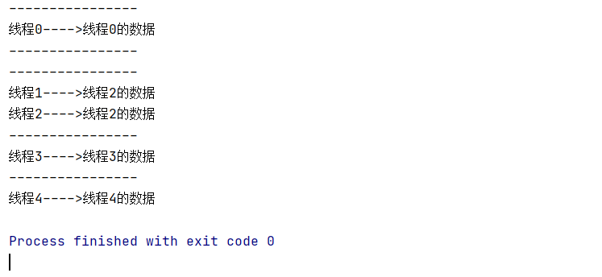

[TOC]

# ThreadLocal详解

# 线程安全的风险案例

```java
public class ThreadLocalDemo {

    private String content;

    public String getContent() {
        return content;
    }

    public void setContent(String content) {
        this.content = content;
    }

    public static void main(String[] args) {
        ThreadLocalDemo demo = new ThreadLocalDemo();

        for (int i = 0; i < 5; i++) {
            Thread thread = new Thread(() -> {
                demo.setContent(Thread.currentThread().getName() + "的数据");
                System.out.println("----------------");
                System.out.println(Thread.currentThread().getName() + "---->" + demo.getContent());
            });

            thread.setName("线程" + i);
            thread.start();
        }

    }
}

```

程序运行结果：



上述代码运行后的结果，可以看到线程取出来的数据不是本线程设置的内容，存在一定的线程安全风险。

解决方式：

使用ThreadLocal来解决：

```java
public class ThreadLocalDemo {

    ThreadLocal<String> threadLocal = new ThreadLocal<>();

    private String content;

    public String getContent() {
        return threadLocal.get();
    }

    public void setContent(String content) {
        threadLocal.set(content);
    }

    public static void main(String[] args) {
        ThreadLocalDemo demo = new ThreadLocalDemo();

        for (int i = 0; i < 5; i++) {
            Thread thread = new Thread(() -> {
                demo.setContent(Thread.currentThread().getName() + "的数据");
                System.out.println("----------------");
                System.out.println(Thread.currentThread().getName() + "---->" + demo.getContent());
            });

            thread.setName("线程" + i);
            thread.start();
        }
    }
    
}
```


# TheadLocal的使用场景

ThreadLocal的使用场景：事务操作。

## 转账案例

### 场景构建

有一个数据表account，表中有两个用户Bob和Jack，用户Jack给Bob转账。

DAO层代码：

```java
import com.mylearn.juc.threadlocal.utils.JdbcUtils;

import java.sql.Connection;
import java.sql.PreparedStatement;
import java.sql.SQLException;

public class AccountDao {

    public void out(String outUser, int money) throws SQLException {
        String sql = "update account set money = money - ? where name = ?";

        Connection connection = JdbcUtils.getConnection();
        PreparedStatement pstm = connection.prepareStatement(sql);
        pstm.setInt(1, money);
        pstm.setString(2, outUser);
        pstm.executeUpdate();

        JdbcUtils.release(pstm, connection);
    }

    public void in(String inUser, int money) throws SQLException {
        String sql = "update account set money = money + ? where name = ?";
        Connection connection = JdbcUtils.getConnection();
        PreparedStatement pstm = connection.prepareStatement(sql);
        pstm.setInt(1, money);
        pstm.setString(2, inUser);
        pstm.executeUpdate();
    }

}
```

Service层代码：

```java
import com.mylearn.juc.threadlocal.dao.AccountDao;

import java.sql.SQLException;

public class AccountService {

    public boolean transfer(String outUser, String inUser, int money) {
        AccountDao accountDao = new AccountDao();
        try {
            accountDao.out(outUser, money);
            accountDao.in(inUser, money);
        } catch (SQLException throwables) {
            throwables.printStackTrace();
            return false;
        }
        return true;
    }

}
```

工具类：

```java
import com.mchange.v2.c3p0.ComboPooledDataSource;

import java.sql.Connection;
import java.sql.SQLException;

public class JdbcUtils {

    private static final ComboPooledDataSource ds = new ComboPooledDataSource();

    public static void commitAndClose(Connection connection) {
        if (connection != null) {
            try {
                connection.commit();
                connection.close();
            } catch (SQLException throwables) {
                throwables.printStackTrace();
            }
        }
    }

    public static void rollbackAndClose(Connection connection) {
        if (connection != null) {
            try {
                connection.rollback();
                connection.close();
            } catch (SQLException throwables) {
                throwables.printStackTrace();
            }
        }
    }

    public static Connection getConnection() {
        Connection connection = null;
        try {
            connection = ds.getConnection();
        } catch (SQLException throwables) {
            throwables.printStackTrace();
        }
        return connection;
    }

    public static void release(AutoCloseable... ios) {
        for (AutoCloseable io : ios) {
            if (io != null) {
                try {
                    io.close();
                } catch (Exception e) {
                    e.printStackTrace();
                }
            }
        }
    }

}
```

引入事务：

在转账中涉及两个DML操作：一个转出、一个转入，需要有原子性，不可分割。

```java
public boolean transfer(String outUser, String inUser, int money) {
    AccountDao accountDao = new AccountDao();
    try {
        accountDao.out(outUser, money);
        // 模拟异常
        int res = 1/0;
        accountDao.in(inUser, money);
    } catch (Exception throwables) {
        throwables.printStackTrace();
        return false;
    }
    return true;
}
```

在上述代码中模拟异常，要么转账成功，要么转账失败。

JDBC中关于事务的操作API:

| Connection接口的方法      | 作用                         |
| ------------------------- | ---------------------------- |
| void setAutoCommit(false) | 禁用事务自动提交（改为手动） |
| void commit();            | 提交事务                     |
| void rollback();          | 回滚事务                     |

开启事务的注意点：

- 为了保证所有的操作在一个事务中，案例使用的连接必须为同一个：service开启的事务的connection必须与dao层访问数据库的connection保持一致。
- 线程并发情况下，每个线程只能操作各自的connection

常规解决方法：

- 传参：从service层将connection对象向dao层传递

- 加锁

以下是代码修改的部分：

service层方法需要加锁，且释放connection

```java
import com.mylearn.juc.threadlocal.dao.AccountDao;
import com.mylearn.juc.threadlocal.utils.JdbcUtils;

import java.sql.Connection;

public class AccountService {

    // 线程并发情况下，为了保证每个线程使用各自的connection，所以加锁synchronized
    public synchronized boolean transfer(String outUser, String inUser, int money) {
        AccountDao accountDao = new AccountDao();
        Connection connection = null;
        try {
            connection = JdbcUtils.getConnection();
            // 禁止事务自动提交
            connection.setAutoCommit(false);
            // 转出
            accountDao.out(connection,outUser, money);
            // 模拟异常
            int res = 1/0;
            // 转入
            accountDao.in(connection,inUser, money);
            // 事务提交
            JdbcUtils.commitAndClose(connection);
        } catch (Exception throwables) {
            throwables.printStackTrace();
            // 事务回滚
            JdbcUtils.rollbackAndClose(connection);
            return false;
        }
        return true;
    }

}
```

dao层需要传入connection且不能释放

```java
public void out(Connection connection,String outUser,int money) throws SQLException {
    String sql = "update account set money = money - ? where name = ?";

    PreparedStatement pstm = connection.prepareStatement(sql);
    pstm.setInt(1, money);
    pstm.setString(2, outUser);
    pstm.executeUpdate();

    // 此处不能释放connection,否则事务不能一致
    // JdbcUtils.release(pstm, connection);
    // 需改为:
    JdbcUtils.release(pstm);
}
```

```java
public void in(String inUser, int money) throws SQLException {
    String sql = "update account set money = money + ? where name = ?";
    Connection connection = JdbcUtils.getConnection();
    PreparedStatement pstm = connection.prepareStatement(sql);
    pstm.setInt(1, money);
    pstm.setString(2, inUser);
    pstm.executeUpdate();
    // 此处不能释放connection,否则事务不能一致
    // JdbcUtils.release(pstm, connection);
    // 需改为:
    JdbcUtils.release(pstm);
}
```

ThreadLocal的解决方案：

```java
public void in(String inUser, int money) throws SQLException {
    String sql = "update account set money = money + ? where name = ?";
    Connection connection = JdbcUtils.getConnection();
    PreparedStatement pstm = connection.prepareStatement(sql);
    pstm.setInt(1, money);
    pstm.setString(2, inUser);
    pstm.executeUpdate();
    // 此处不能释放connection,否则事务不能一致
    // JdbcUtils.release(pstm, connection);
    // 需改为:
    JdbcUtils.release(pstm);
}
```

ThreadLocal的好处：

- 传递数据：保存每个线程的绑定的数据，在需要的地方可以直接获取，避免参数直接传递带来的代码耦合问题。
- 线程隔离：各线程直接的数据相互隔离又具备并发性，避免同步方式带来的性能损失。

