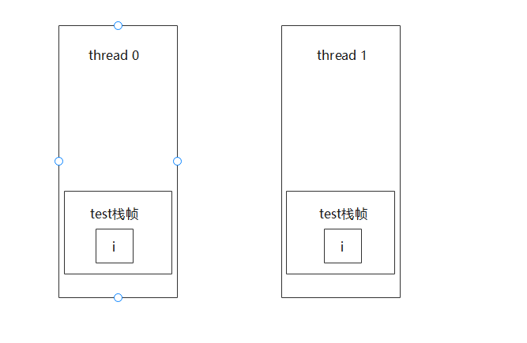

# Java多线程总结

## 并发和并行的概念

- 并发concurrent：同一时间应对多件事，cpu在多个线程上下快速切换
- 并行parallel：同一时间做多件事，cpu多个核心同时执行多个线程

## 异步和同步

- 同步：需要等待结果才能继续运行

- 异步：不需要等待结果就能返回

## 线程上下文切换

cpu在运行线程过程中，可能会暂停执行当前线程，转而执行其他线程，发生这样的原因通常有：

- 线程的cpu时间片用完
- 垃圾回收
- 有更高优先级的线程需要执行
- 线程调用了sleep、yield、wait、join、park、synchronized、lock等方法

当Context Switch发生时，需要由操作系统保存当前线程的状态，恢复另一个线程的状态，Java中对应的概念就是程序计数器Program Counter Register，它的作用是记住下一个jvm指令的执行地址，是线程私有的。

- Context Switch频繁发生会影响性能
- 状态包括了程序计数器、虚拟机栈中每个栈的信息，如局部变量、操作数栈、返回地址等

## 创建线程的方法

### 1. 直接使用Thread

```java
public class Test1 {

    public static void main(String[] args) {

        // 1.创建线程
        Thread t = new Thread() {
            // 2. 线程要执行的任务
            @Override
            public void run() {
                System.out.println(Thread.currentThread().getName() + " running...");
            }
        };

        t.start();

        System.out.println(Thread.currentThread().getName() + " running...");
    }

}
```

### 2. 使用Runnable配合Thread

线程和任务分离开来

```java
public class Test2 {

    public static void main(String[] args) {

        // 线程要执行的任务
        Runnable runnable = new Runnable() {
            @Override
            public void run() {
                System.out.println(Thread.currentThread().getName() + " running...");
            }
        };

        // 2. 创建线程
        new Thread(runnable).start();

        System.out.println(Thread.currentThread().getName() + " running...");
    }

}
```

Runnable的创建也可以使用lambda表达式来处理：

```java
@Test
public void test2() {
    Runnable runnable = () -> {
        System.out.println(Thread.currentThread().getName() + " running...");
    };
}
```

### 3. 使用FutureTask、Callable、Thread组合获取线程返回值

```java
public class Test3 {
    public static void main(String[] args) throws ExecutionException, InterruptedException {
        FutureTask<Integer> futureTask = new FutureTask<>(new Callable<Integer>() {
            @Override
            public Integer call() throws Exception {
                Thread.sleep(1000);
                return 100;
            }
        });

        Thread t = new Thread(futureTask, "futureTask thread");
        t.start();

        System.out.println(futureTask.get());
    }
}
```

## idea设置多线程debug模式

断点上右击，把 All 改成 Thread，有多个线程的话，需要在多个断点上都需要设置


## 线程状态

### 5种状态

1. 初始状态：仅仅是新建了线程
2. 可运行状态（就绪状态）：指该线程被创建，可以由cpu调度执行
3. 运行状态：获取了cpu时间片，正在运行；当cpu时间片用完，会进入到可运行状态
4. 阻塞状态：如果调用了阻塞api，线程会释放cpu，不占据cpu资源
5. 终止状态：线程执行完成后的状态

### java线程6种状态

1. New: 新创建的线程，尚未执行
2. Runnable：调用了线程的start方法，线程进入runnable状态；java线程中将就绪ready和运行中running两种状态笼统的称为“运行”；当线程被调用了start方法，可能在等待cpu的使用权，此时处于就绪状态；就绪的线程在获得cpu时间片后变为运行中状态running
3. Blocked: 线程被阻塞
4. waiting: 线程在等待其他线程做出一些动作
5. 超时等待time_waiting: 该状态不同于waiting，可以在规定的时间内自行返回
6. 终止terminated: 线程执行完毕

### java线程状态的实例

```java
import java.util.concurrent.TimeUnit;

public class TestState {

    public static void main(String[] args) throws InterruptedException {
        Thread t1 = new Thread(() -> {
            System.out.println("running...");
        });

        Thread t2 = new Thread(() -> {
            while (true) {

            }
        });
        t2.start();

        Thread t3 = new Thread(() -> {
            System.out.println("t3 running...");
        });
        t3.start();

        Thread t4 = new Thread(() -> {
            synchronized (TestState.class) {
                try {
                    TimeUnit.SECONDS.sleep(9999);
                } catch (InterruptedException e) {
                    e.printStackTrace();
                }
            }
        });
        t4.start();


        Thread t5 = new Thread(() -> {
            try {
                t2.join();
            } catch (InterruptedException e) {
                e.printStackTrace();
            }
        });
        t5.start();

        Thread t6 = new Thread(() -> {
            synchronized (TestState.class) {
                try {
                    TimeUnit.SECONDS.sleep(9999);
                } catch (InterruptedException e) {
                    e.printStackTrace();
                }
            }
        });
        t6.start();

        TimeUnit.SECONDS.sleep(1);

        System.out.println(t1.getState());
        System.out.println(t2.getState());
        System.out.println(t3.getState());
        System.out.println(t4.getState());
        System.out.println(t5.getState());
        System.out.println(t6.getState());
    }
}
```

# 临界区

多个线程对共享区域进行操作，这片区域就被称为是临界区。

# 问题

临界区存在线程安全问题：

```java
	static int counter = 0;

    public static void main(String[] args) {
        Thread thread1 = new Thread(() -> {
            for (int j = 0; j < 99999; j++) {
                counter++;
            }
        });

        Thread thread2 = new Thread(() -> {
            for (int i = 0; i < 99999; i++) {
                counter--;
            }
        });

        thread1.start();
        thread2.start();

        try {
            thread1.join();
            thread2.join();
        } catch (InterruptedException e) {
            e.printStackTrace();
        }

        System.out.println(counter);
    }
```

程序运行结果：


结果是随机的，按照程序设计的本意应该是为0，但实际得不到这个结果。

# synchronized

```java
synchronized(对象){
   临界区
}
```


## synchronized解决线程安全问题

```java
	static int counter = 0;

    static final Object obj = new Object();

    public static void main(String[] args) {
        Thread thread1 = new Thread(() -> {
            for (int j = 0; j < 99999; j++) {
                synchronized (obj) {
                    counter++;
                }
            }
        });

        Thread thread2 = new Thread(() -> {
            for (int i = 0; i < 99999; i++) {
                synchronized (obj) {
                    counter--;
                }
            }
        });

        thread1.start();
        thread2.start();

        try {
            thread1.join();
            thread2.join();
        } catch (InterruptedException e) {
            e.printStackTrace();
        }

        System.out.println(counter);
    }
```

此时运行结果无论如何都是 **0** .

## synchronized理解

- synchronized(对象)中的对象，可以想象成一个房间(room)，有唯一入口(门)房间只能一次进入一个人进行计算，线程t1,t2想象成两个人
- 当线程t1执行到synchronized(room)时就好比t1进入了房间，并锁住了门拿走钥匙，在门内执行count++代码
- 这时如果t2也运行到了synchronized(room)时，发现门被锁住了，只能在门外等待，发生了上下文切换，阻塞住了
- 这中间即使t1的cpu时间片不幸用完，被踢出了门外(不要错误理解为锁住了对象就能一直执行下去)，这时门还是锁住的，t1仍拿着钥匙，t2线程还在阻塞状态进不来，只有下次轮到t1自己再次获得时间片时才能开门进入
- 当t1执行完synchronized{}块内的代码，这时候才会从obj房间出来并解开门上的锁，唤醒t2线程并把钥匙给他。t2线程这时才能进入obj房间，锁住了门拿上钥匙，执行它的count--代码

## synchronized面向对象的改进

```java
class Room {
    private int counter;

    public void increment() {
        synchronized (this) {
            counter++;
        }
    }

    public void decrement() {
        synchronized (this) {
            counter--;
        }
    }

    public int getCounter() {
        synchronized (this) {
            return counter;
        }
    }
}
```

## synchronized方法

```java
public synchronized void increment(){
	...
}
```

相当于

```java
public void increment(){
	synchronized(this){
		...
	}
}
```

这样的方式都是锁住的实例对象。

**注意：synchronized修饰的如果是static方法，则锁住的是所在的Class对象**

## 线程"八锁"问题

略

## 变量的线程安全分析

### 成员变量和静态变量的线程安全分析

- 如果没有变量在线程之间共享，那么变量是安全的
- 如果变量在线程之间共享：
  - 如果只有读操作，那么变量安全
  - 如果有读写操作，则这段代码是临界区，需要考虑线程安全

### 局部变量线程安全分析

- 局部变量是基本数据类型的，则是安全的
- 局部变量引用的对象未必是安全的
  - 如果局部变量引用的对象没有引用线程共享的对象，那么是线程安全的
  - 如果局部变量引用的对象引用了一个线程共享的对象，那么要考虑线程安全

### 线程安全的情况

```java
public static void test(){
	int i = 10;
    i++
}
```

每个线程调用test()方法时，局部变量i，会在每个线程的栈帧中被创建多份，因此不存在共享



### 线程不安全的情况

```java
public class Test15 {
    public static void main(String[] args) {
        UnsafeTest unsafeTest = new UnsafeTest();
        for (int i = 0; i < 100; i++) {
            new Thread(() -> {
                unsafeTest.method1();
            }).start();
        }
    }
}

class UnsafeTest {
    // 成员变量
    ArrayList<String> arrayList = new ArrayList<>();

    public void method1() {
        for (int i = 0; i < 100; i++) {
            method2();
            method3();
        }
    }

    public void method2() {
        arrayList.add("1");
    }

    public void method3() {
        arrayList.remove(0);
    }
}
```

解决方法，将arrayList改为局部变量，就可以解决线程安全问题了：

```java
class SafeTest {
    public void method1() {
        ArrayList<String> arrayList = new ArrayList<>();
        for (int i = 0; i < 100; i++) {
            method2(arrayList);
            method3(arrayList);
        }
    }

    public void method2(ArrayList arrayList) {
        arrayList.add("1");
    }

    public void method3(ArrayList arrayList) {
        arrayList.remove(0);
    }
}
```

## 常见线程安全类

1. String
2. Integer
3. StringBuffer
4. Random
5. Vector
6. Hashtable
7. java.util.concurrent包下的类

这里的线程安全指的是，多个线程调用它们的同一个实例的某个方法时，是线程安全的。也可以理解它们的每个方法是原子的

但需要注意的是，它们多个方法的组合不是原子的，见下面分析：

```java
Hashtable table = new Hashtable();
if(table.get("key")==null){
	table.put("key",value);
}
```

	

### 不可变类的线程安全

String 和 Integer 类都是不可变的类，因为其类内部状态是不可改变的，因此他们的方法都是线程安全的。


## 示例分析-是否线程安全

示例一

下面这个示例是线程不安全的，MyAspect切面类只有一个实例，成员变量start会被多个线程同时读写操作

```java
@Aspect
@Component
public class MyAspect {
    // 是否线程安全
    private long start = 0l;

    public void before() {
        start = System.nanoTime();
    }

    public void after() {
        long end = System.nanoTime();
        System.out.println("cost time: " + (end - start));
    }
}
```

示例二

`MyServlet` `UserServiceImpl` `UserDaoImpl`类都只有一个实例，`UserDaoImpl`类中没有成员变量，`update`方法里的变量引用的对象不是线程共享的，所以是线程安全的；`UserServiceImpl`类中只有一个线程安全的`UserDaoImpl`类的实例，那么`UserServiceImpl`类也是线程安全的，同理 `MyServlet`也是线程安全的

```java
public class MyServlet extends HttpServlet {
    // 是否安全
    private UserService userService = new UserServiceImpl();

    public void doGet(HttpServletRequest request, HttpServletResponse response) {
        userService.update();
    }
}

class UserServiceImpl implements UserService {
    // 是否安全
    private UserDao userDao = new UserDaoImpl();

    public void update() {
        userDao.update();
    }
}

interface UserService {
    void update();
}

class UserDaoImpl implements UserDao {
    public void update() {
        String sql = "update user set password = ? where username = ?";
        // 是否安全
        try (Connection connection = DriverManager.getConnection("", "", "")) {
            // ...
        } catch (Exception e) {
            // ...
        }
    }
}

interface UserDao {
    void update();
}
```

示例三

在userDaoImpl中有成员变量，那么多个线程可以对成员变量进行操作，所以不是线程安全的

```java
public class MyServlet extends HttpServlet {
    // 是否安全
    private UserService userService = new UserServiceImpl();

    public void doGet(HttpServletRequest request, HttpServletResponse response) {
        userService.update(...);
    }
}

public class UserServiceImpl implements UserService {
    // 是否安全
    private UserDao userDao = new UserDaoImpl();

    public void update() {
        userDao.update();
    }
}

public class UserDaoImpl implements UserDao {
    // 是否安全
    private Connection conn = null;

    public void update() throws SQLException {
        String sql = "update user set password = ? where username = ?";
        conn = DriverManager.getConnection("", "", "");
        // ...
        conn.close();
    }
}
```

示例四

每个线程访问时，都会新建一个userDao对象，新建的对象是线程独有的，所以是线程安全的

```java
public class MyServlet extends HttpServlet {
    // 是否安全
    private UserService userService = new UserServiceImpl();
    public void doGet(HttpServletRequest request, HttpServletResponse response) {
        userService.update(...);
    }
}
public class UserServiceImpl implements UserService {
    public void update() {
        UserDao userDao = new UserDaoImpl();
        userDao.update();
    }
}
public class UserDaoImpl implements UserDao {
    // 是否安全
    private Connection = null;
    public void update() throws SQLException {
        String sql = "update user set password = ? where username = ?";
        conn = DriverManager.getConnection("","","");
        // ...
        conn.close();
    }
}
```

示例五

```java
public abstract class Test {
    public void bar() {
        // 是否安全
        SimpleDateFormat sdf = new SimpleDateFormat("yyyy-MM-dd HH:mm:ss");
        foo(sdf);
    }
    public abstract foo(SimpleDateFormat sdf);
    public static void main(String[] args) {
        new Test().bar();
    }
}
```

其中foo方法是不确定的，可能导致不安全的发生，被称之为**外星方法**，因为foo方法可以被重写，导致线程不安全。在String类中就考虑到了这一点，String类是finally的，子类不能重写它的方法。

# Monitor

## Monitor原理

Monitor被翻译称为监视器或管程。

每个java对象都可以关联一个Monitor，如果使用synchronized给对象上锁(重量级)，该对象头上的MarkWord就被设置为指向Monitor对象的指针。

- 刚开始时，Monitor的owner为空
- 当thread-1执行synchronized(obj){}代码时，会将Monitor的owner设置为thread1，上锁成功后，Monitor中同一时刻只能有一个owner
- 当thread-1占据锁时，如果thread2和thread3也执行到synchronized(obj){}时，就会进入到EntryList中，变成Blocked状态
- 当thread-1执行完同步代码后，然后唤醒entryList中等待的线程来竞争，竞争时是非公平的
- waitset中的thread4和thread5是之前获得过锁，但条件不满足进入waiting状态的线程，后面讲wait-notify时会分析


# synchronized原理进阶

## 轻量级锁

使用场景：如果一个对象虽然有多个线程要对它进行加锁，但是加锁的时间是错开的，那么可以使用轻量级锁来进行优化。轻量级锁对用户来说是透明的，语法仍然是synchronized，假设有两个方法同步块，利用同一个对象加锁

```java
static final Object obj = new Object();
public static void method1(){
	synchronized(obj){
		// 同步块A
		method2();
	}
}

public static void method2(){
	synchronized(obj){
	
	}
}
```

1. 每次执行到synchronized代码块时，都会创建锁记录(Lock Record)对象，每个线程都会记录一个锁记录的结构，锁记录内部可以储存对象的Mark Word和对象引用reference.


2. 让锁记录中的Object refernce指向对象，并且尝试使用cas替换Object对象的Mark Word，将Mark Word的值存入锁记录中。


3. 如果cas替换成功，那么对象的对象头存储的就是锁记录的地址和状态01，如下所示

   

4. 如果cas失败，有两种情况：

   1. 如果是其他线程已经持有了Object的轻量级锁，那么表示有竞争，将进入锁膨胀状态
   2. 如果是自己的线程已经执行了synchronized进行加锁，那么再添加一条锁记录Lock Record作为重入的计数

   

5. 当线程退出synchronized代码块的时候，如果获取的取值是null的锁记录，表示有重入，这时重置锁记录，表示重入计数减一


6. 当线程退出synchronized代码块时，如果获取的锁记录取值不为null，那么使用cas将Mark word的值恢复给对象
   1. 成功则解锁成功
   2. 失败，则说明轻量级锁进行了锁膨胀或已经升级为重量级锁，进入重量级锁解锁流程

## 锁膨胀

如果在尝试加轻量级锁的过程中，cas操作无法成功，这是有一种情况就是其它线程已经为这个对象加上了轻量级锁，这时就要进行锁膨胀，将轻量级锁变成重量级锁

1. 当thread-1进行轻量级加锁时，thread-0已经对该对象加了轻量级锁

   

2. 这时thread-1加轻量级锁失败，进入锁膨胀流程

   1. 即为对象申请Monitor锁，让Object指向重量级锁地址，然后自己进入Monitor的EntryList变成BLOCKED状态

   

   

3. 当thread-0退出synchronized代码块时，使用cas将Mark Word的值恢复给对象头，那么会进入重量级锁的解锁过程，即按照Monitor的地址找到Monitor对象，将Owner对象置为null，唤醒EntryList的thread线程

## 偏向锁

在轻量级锁中，我们可以发现，如果同一个线程对同一个2对象进行重入锁时，也需要执行CAS操作，这是有点耗时的，在java6中开始引入偏向锁的概念，只有第一次使用CAS时将对象的Mark Word头设置为入锁线程id，之后这个入锁线程再进行重入锁时，发现线程ID是自己，那么就不再进行CAS了


# Wait和Notify

## 同步模式之保护性暂停

即Guarded Suspension，用在一个线程等待另一个线程的执行结果：

1. 有一个结果需要从一个线程传递到另一个线程，让他们关联同一个GuardedObject
2. 如果有结果不断从一个线程到另一个线程，那么可以使用消息队列(生产者/消费者)
3. JDK中，join的实现、Future的实现，采用的就是此模式
4. 因为要等待另一个结果，因此归类到同步模式


多任务版的GuardedObject图中Futures就好比信箱，左侧的t0, t2,t4就好比等待邮件的居民，右侧的t1/t3/t5就好比邮递员如果需要在多个类之间使用GuardedObject对象，作为参数传递不是很方便，因此设计一个用来解耦的中间类，这样不仅能解耦【结果等待者】和【结果生产者】，还能够同时支持多个任务的管理。


## 异步模式之生产者/消费者

1. 与前面的保护性暂停中的GuardedObject不同，不需要产生结果和消费结果的线程一一对应。
2. 消费队列可以用来平衡生产和消费的线程资源
3. 生产者仅负责产生结果数据，不关系数据如何处理，而消费者专心处理结果数据
4. 消息队列是有容量限制的，满时不会再加入数据，空时不会再消耗数据
5. JDK中各种阻塞队列，采用的就是这种模式

**异步**的意思就是生产者产生消息之后消息没有立即被消费掉，而"同步模式"中，消息在产生后被立即消费了


# Park和Unpark

## 基本使用

```java
// 暂停当前线程
LockSupport.park();
// 恢复某个线程的运行
LockSupport.unpark();
```

## park和unpark原理

每个线程都有自己的一个Parker对象，由三部分组成：_counter, _cond 和 _mutex

1. 线程就像一个旅人，Parker就像他随身携带的背包，条件变量_cond就好比背包中的帐篷，_counter就好比背包中的备用干粮（0耗尽，1为充足）
2. 调用park就是看需不需要停下来歇息
   1. 如果备用干粮耗尽，那么钻进帐篷歇息
   2. 如果备用干粮充足，那么不需要停留，继续前进
3. 调用unpark，就好比干粮充足
   1. 如果这时线程还在帐篷，就唤醒让他继续前进
   2. 如果这时线程还在运行，那么下次他调用park时，仅是消耗掉备用干粮，不需要停留继续前进

## 先调用park再调用unpark的过程

1. 先调用park

   1. 当前线程调用Unsafe.park()方法
   2. 检查_counter, 本情况为0，这时获得`_mutex`锁（`_mutex`对象有个等待队列`_cond`）
   3. 线程进入`_cond`条件变量阻塞
   4. 设置`_counter`为0

   

2. 调用unpark

   1. 调用Unsafe.unpark(Thread-0)方法，设置`_counter`为0
   2. 唤醒`_cond`条件变量中的thread-0
   3. thread-0恢复运行
   4. 设置`_counter`为0

   


## 先调用unpark再调用park的过程

1. 调用Unsafe.unpark(Thread_0)的方法，设置_counter为1
2. 当前线程调用Unsafe.park()方法
3. 检查_counter，本情况为1，这时线程无需阻塞，继续运行
4. 设置_counter为0


# 特点

与Object的wait和notify相比：

- wait, notify, notifyAll 必须配合Object Monitor一起使用，而unpark不必
- park,unpark是以线程为单位来【阻塞】和【唤醒】线程，而notify只能随机唤醒一个线程，notifyAll是唤醒所有线程，就不那么【精确】
- park 和 unpark 可以先unpark，而wait和notify 不能先notify


# 线程状态转换

## 1.  New <---> RUNNABLE

- 当调用t.start()方法时，由new ----> runnable

## 2. RUNNABLE <---> WAITING

1. 线程用synchronized(obj)获取对象锁
   1. 调用obj.wait方法时，t线程从runnable ----> waiting
   2. 调用obj.notify、obj.notifyAll、t.interrupt时
      1. 竞争锁成功，t 线程从waiting ----> runnable
      2. 竞争锁失败，t 线程从waiting -----> blocked
   3. wait是可以释放锁的，sleep是不释放锁

```java
import lombok.extern.slf4j.Slf4j;
import java.util.concurrent.TimeUnit;
@Slf4j
public class TestWaitNotify {
    public static void main(String[] args) {
        final Object obj = new Object();
        new Thread(() -> {
            synchronized (obj) {
                log.debug("执行...");
                try {
                    obj.wait();
                } catch (InterruptedException e) {
                    e.printStackTrace();
                }
                log.debug("其他代码...");
            }
        }, "t1").start();

        new Thread(() -> {
            synchronized (obj) {
                log.debug("执行...");
                try {
                    obj.wait();
                } catch (InterruptedException e) {
                    e.printStackTrace();
                }
                log.debug("其他代码...");
            }
        }, "t2").start();

        try {
            TimeUnit.SECONDS.sleep(1);
        } catch (InterruptedException e) {
            e.printStackTrace();
        }
        log.debug("唤醒obj上其他线程");
        synchronized (obj) {
            obj.notifyAll();
        }
    }
}
```

## 3. RUNNABLE <---> WAITING

- 当前线程调用 t.join() 方法时，当前线程从runnable ---> waiting
  - 注意是当前线程在 t 线程对象的监视器上等待

- t 线程运行结束，或调用了当前线程的 interrupt() 时，当前线程从 waiting ----> runnable

## 4. RUNNABLE <---> WAITING

- 当前线程调用了LockSupport.park()方法会让当前线程从RUNNABLE ---> WAITING
- 调用LockSupport.unpark(目标线程) 或调用了 线程的interrupt()，会让目标线程从 WAITING ----> RUNNABLE

## 5. RUNNABLE <----> TIME_WATING

1. 当前线程调用t.join(long n)方法时，当前线程从RUNNABLE  ---->  TIME_WAITING 注意是当前线程在 t 线程对象的监视器上等待
2. 当前时间超过了 n 毫秒，或 t 线程运行结束，或调用了 当前线程的 interrupt() 时，当前线程 从TIME_WAITING ->  RUNNABLE

## 6. RUNNABLE <---> TIME_WAITING

1. 当前线程调用 Thread.sleep(long n) ， 当前线程从 RUNNABLE ----> time_waiting
2. 当前线程等待时间超过了 n 毫秒或调用了线程的 interrupt()， 当前线程 从 TIME_WAITING  ----> RUNNABLE

## 7. RUNNABLE <--------> TIME_WAITING

1. 当前线程调用LockSupport.parkNanos(long nanos) 或 LockSupport.parkUnit(long millis) 时，当前线程从 RUNNABLE ----> time_waiting
2. 调用LockSupport.unpark(目标线程) 或调用线程的 interrupt()时，或是等待超时，会让目标从 TIME_WAITING ---> RUNNABLE


# 活跃性

活跃性相关的一系列问题都可以用ReentrantLock进行解决

## 死锁

有一种情况：一个线程需要同时获得多把锁，这时就容易发生死锁 : t1线程获得 A 对象锁，接下来想获得 B 对象锁； t2 线程获得 B 对象锁，接下来想获得 A 对象的锁

## 检测死锁

检测死锁可以使用 jconsole工具； 或者利用 jps 定位线程id ，再用 jstack 定位死锁

## 哲学家就餐问题


有五位哲学家，围坐在圆桌旁。 他们只做两件事，思考和吃饭，思考一会吃口饭，吃完饭后接着思考。 吃饭时要用两根筷子吃，桌上共有 5 根筷子，每位哲学家左右手边各有一根筷子。 如果筷子被身边的人拿着，自己就得等待。

当每个哲学家即线程持有一根筷子时，他们都在等待另一个线程释放锁，因此造成了死锁。这种线程没有按预期结束，执行不下去的情况，归类为【活跃性】问题，除了死锁以外，还有活锁和饥饿者两

种情况

## 饥饿

很多教程把饥饿定义为：一个线程由于优先级太低，始终得不到CPU调度执行，也不能够结束。

死锁的情况：


顺序加锁的解决方案：


# 多把锁

原始需求：sleep方法和study方法加锁，只能单个线程调用执行；

如下代码：在sleep和study方法上加了锁后，sleep和study也互斥，降低了并发性

```java
import lombok.extern.slf4j.Slf4j;

@Slf4j
public class BigRoom {
    public void sleep(){
        synchronized (this){
            log.debug("sleep...");
        }
    }

    public void study(){
        synchronized (this){
            log.debug("study...");
        }
    }
}
```

解决方法：

```java
import lombok.extern.slf4j.Slf4j;

@Slf4j
public class BigRoom {

    private BigRoom studyRoom = new BigRoom();
    private BigRoom sleepRoom = new BigRoom();

    public void sleep(){
        synchronized (sleepRoom){
            log.debug("sleep...");
        }
    }

    public void study(){
        synchronized (studyRoom){
            log.debug("study...");
        }
    }
}
```

将锁的粒度细分：

- 好处：是可以增强并发性
- 坏处： 如果一个线程需要同时获得多把锁，就容易发生死锁

## 线程方法API

- start()

  启动线程，线程以异步的方式来执行；

  启动一次后，不可以再重复调用，否则会出现异常

- run()

  启动异步线程后，线程run方法中的内容；

  如果直接调用run方法，那么run方法就相当于是一个普通方法，被他所在的那个线程调用，也就是同步执行，不会异步执行

- state

  线程状态

- sleep

  sleep方法，会让线程进入睡眠，此时线程的状态是time waiting；

  其他线程可以使用interrupt方法打断正在睡眠的线程，这时sleep线程会抛出InterruptedException，sleep线程继续执行；

  sleep结束的线程未必会立即得到执行；

  建议使用TimeUnit的sleep代替Thread的sleep来获得更好的可读性；

- yield

  调用yield方法会让当前线程从running进入runnable就绪状态，然后调度其他线程；

  注意：调用了yield方法，并不会切换到别的线程，具体的线程依赖于操作系统的任务调度

- 线程优先级setPriority

  线程优先级会提示cpu调度器优先调度该线程；

  如果在cpu比较忙时，优先级高的线程会获得更多的时间片，但cpu闲时，优先级几乎没有作用

- isInterrupted

  判断是否被打断，不会清除**打断标记**

- isAlive

  判读线程是否还存活

- interrupt

  打断线程，如果线程正在sleep, wait, join会导致被打断的线程抛出InterruptedException，并清除打断标记；

  如果打断正在运行的线程，则会设置打断标记

  ```java
  	public static void main(String[] args) {
          Thread thread = new Thread(()->{
              try {
                  TimeUnit.SECONDS.sleep(5);
              } catch (InterruptedException e) {
                  e.printStackTrace();
              }
          });
          thread.start();
  
          try {
              TimeUnit.SECONDS.sleep(1);
          } catch (InterruptedException e) {
              e.printStackTrace();
          }
  
          thread.interrupt();	// 打断sleep的线程，会清除标记;打断running的线程，打断标记为false
          System.out.println("线程状态：" + thread.getState() + " 打断标记：" + thread.isInterrupted());
      }
  ```

  输出结果：

  ```java
  java.lang.InterruptedException
  	at java.lang.Thread.sleep(Native Method)
  	at java.util.concurrent.TimeUnit.sleep(TimeUnit.java:386)
  	at com.mylearn.thread.Test6.lambda$main$0(Test6.java:9)
  	at com.mylearn.thread.Test6$$Lambda$1/0x0000000000000000.run(Unknown Source)
  	at java.lang.Thread.run(Thread.java:823)
  线程状态：RUNNABLE 打断标记：false
  ```

  如果打断的线程是running的状态，打断标记会被置为true，但也仅仅是将打断标记置为了true，线程仍然会继续执行。

  ```java
  public static void main(String[] args) {
      Thread thread = new Thread(()->{
          while(true){
              if(Thread.currentThread().isInterrupted()){
                  break;
              }
              System.out.println(1);
          }
      });
      thread.start();
      thread.interrupt();
      System.out.println("线程状态：" + thread.getState() + " 打断标记：" + thread.isInterrupted());
  }
  ```

- interrupted

  判断当前线程是否被打断，会清除打断标记

- currentedThread

  获取当前正在执行的线程

- join

  a线程调用b线程的join方法，a线程会等待b线程执行完后再继续执行。

  ```java
  static int res = 0;
  
  public static void main(String[] args) {
      Thread thread = new Thread(() -> {
          try {
              TimeUnit.SECONDS.sleep(1);
          } catch (InterruptedException e) {
              e.printStackTrace();
          }
          res = 10;
      });
      thread.start();
      try {
          thread.join();
      } catch (InterruptedException e) {
          e.printStackTrace();
      }
      System.out.println(res);
  }
  ```

  如果有多个线程时，主线程可以调用多个线程的join方法，使得main线程等待所有线程都执行完再继续执行main线程。

  ```java
  	static int r1 = 0;
      static int r2 = 0;
      public static void main(String[] args) {
          Thread thread1 = new Thread(()->{
              r1 = 10;
              try {
                  TimeUnit.SECONDS.sleep(1);
              } catch (InterruptedException e) {
                  e.printStackTrace();
              }
          });
          Thread thread2 = new Thread(()->{
              r2 = 20;
              try {
                  TimeUnit.SECONDS.sleep(2);
              } catch (InterruptedException e) {
                  e.printStackTrace();
              }
          });
  
          thread1.start();
          thread2.start();
          long start = System.currentTimeMillis();
  
          try {
              thread1.join();
              thread2.join();
          } catch (InterruptedException e) {
              e.printStackTrace();
          }
          System.out.println(System.currentTimeMillis() - start);
      }
  ```

  join方法也可以指定时间来等待。

## 两阶段终止模式

### 概念

在一个线程T1中，如何优雅的终止线程T2？

### 错误思路

1. 使用线程的stop方法

   stop方法会真正杀死进程，如果这时线程锁住了共享资源，那么当它被杀死后，再也没机会释放锁，其他线程永远无法获取锁

2. 使用System.exit(1)

   这种做法会让整个程序都停止。

### 正确思路

```java
	public static void main(String[] args) throws InterruptedException {
        TwoPhaseTermination twoPhaseTermination = new TwoPhaseTermination();
        twoPhaseTermination.start();
        TimeUnit.SECONDS.sleep(5);
        twoPhaseTermination.stop();
    }

    static class TwoPhaseTermination {
        private Thread monitorThread;

        public void start() {
            monitorThread = new Thread(() -> {
                while (true) {
                    Thread current = Thread.currentThread();
                    if (current.isInterrupted()) {
                        System.out.println("料理后事");
                        break;
                    }
                    try {
                        TimeUnit.SECONDS.sleep(1);
                        System.out.println("running monitor");
                    } catch (InterruptedException e) {
                        current.interrupt();
                    }
                }
            });
            monitorThread.start();
        }

        public void stop() {
            monitorThread.interrupt();
        }
    }
```

## 打断park的线程

可以使用工具类LockSupport来使线程暂停，可以使用interrupt打断正在park的线程，被打断的park线程无法再次park，除非清除打断标记。

```java
	public static void main(String[] args) throws InterruptedException {
        Thread t1 = new Thread(() -> {
            System.out.println("park...");
            LockSupport.park();
            System.out.println("unpark");
            LockSupport.park();
            System.out.println("打断标记: " + Thread.currentThread().isInterrupted());
            System.out.println("打断标记: " + Thread.interrupted());
            LockSupport.park();

        });
        t1.start();

        TimeUnit.SECONDS.sleep(1);
        t1.interrupt();
    }
```

## 过时不推荐的方法

- stop
- suspend
- resume

## 主线程和守护线程

设置守护线程： setDaemon(true)


## 应用篇

### 效率

- sleep效率降低cpu使用率

  在while(true)中，程序执行会使cpu使用率急剧升高，可以通过sleep方法降低cpu的使用率**踩油门踩刹车**

  ```java
  public static void main(String[] args) {
          while (true){
              try {
                  TimeUnit.MICROSECONDS.sleep(1);
              } catch (InterruptedException e) {
                  e.printStackTrace();
              }
          }
      }
  ```

- 泡茶

  老王洗水壶、烧水；小王洗茶壶、拿茶叶、洗茶杯、泡茶

  ```java
  	public static void main(String[] args) {
          Thread thread1 = new Thread(() -> {
              try {
                  System.out.println("洗水壶");
                  TimeUnit.SECONDS.sleep(1);
                  System.out.println("烧开水");
                  TimeUnit.SECONDS.sleep(5);
              } catch (InterruptedException e) {
                  e.printStackTrace();
              }
          }, "老王");
  
          Thread thread2 = new Thread(() -> {
              try {
                  System.out.println("洗茶壶");
                  TimeUnit.SECONDS.sleep(1);
                  System.out.println("洗茶杯");
                  TimeUnit.SECONDS.sleep(1);
                  System.out.println("拿茶叶");
                  TimeUnit.SECONDS.sleep(1);
  
                  thread1.join();
                  System.out.println("泡茶");
              }catch (InterruptedException e){
                  e.printStackTrace();
              }
          }, "小王");
  
          thread1.start();
          thread2.start();
      }
  ```

  


