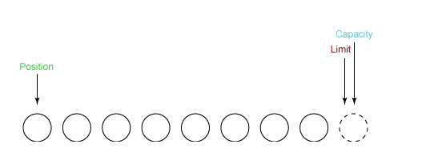

# Java NIO

## 通道和缓冲区

### 1. 通道

通道 Channel 是对原 I/O 包中的流的模拟，可以通过它读取和写入数据。

通道与流的不同之处在于，流只能在一个方向上移动(一个流必须是 InputStream 或者 OutputStream 的子类)，而通道是双向的，可以用于读、写或者同时用于读写。

通道包括以下类型:

- FileChannel: 从文件中读写数据；
- DatagramChannel: 通过 UDP 读写网络中数据；
- SocketChannel: 通过 TCP 读写网络中数据；
- ServerSocketChannel: 可以监听新进来的 TCP 连接，对每一个新进来的连接都会创建一个 SocketChannel。

### 2. 缓冲区

发送给一个通道的所有数据都必须首先放到缓冲区中，同样地，从通道中读取的任何数据都要先读到缓冲区中。也就是说，不会直接对通道进行读写数据，而是要先经过缓冲区。

缓冲区实质上是一个数组，但它不仅仅是一个数组。缓冲区提供了对数据的结构化访问，而且还可以跟踪系统的读/写进程。

缓冲区包括以下类型:

- ByteBuffer
- CharBuffer
- ShortBuffer
- IntBuffer
- LongBuffer
- FloatBuffer
- DoubleBuffer

## 缓冲区状态变量

- capacity: 最大容量；
- position: 当前已经读写的字节数；
- limit: 还可以读写的字节数。

状态变量的改变过程举例:

① 新建一个大小为 8 个字节的缓冲区，此时 position 为 0，而 limit = capacity = 8。capacity 变量不会改变，下面的讨论会忽略它。



② 从输入通道中读取 5 个字节数据写入缓冲区中，此时 position 移动设置为 5，limit 保持不变。


③ 在将缓冲区的数据写到输出通道之前，需要先调用 flip() 方法，这个方法将 limit 设置为当前 position，并将 position 设置为 0。


④ 从缓冲区中取 4 个字节到输出缓冲中，此时 position 设为 4。


⑤ 最后需要调用 clear() 方法来清空缓冲区，此时 position 和 limit 都被设置为最初位置。


## 文件NIO的实例

```java
import java.io.FileInputStream;
import java.io.FileOutputStream;
import java.io.IOException;
import java.nio.ByteBuffer;
import java.nio.channels.FileChannel;

public class FileChannelUtils {

    public static void fastCopy(String src,String dist) throws IOException {
        // 获取源文件的输入字节流
        FileInputStream fileInputStream = new FileInputStream(src);
        // 获取输入字节流的文件通道
        FileChannel fileChannelIn = fileInputStream.getChannel();

        // 获取目标文件的输出字节流
        FileOutputStream fileOutputStream = new FileOutputStream(dist);
        // 获取输出字节流的通道
        FileChannel fileChannelOut = fileOutputStream.getChannel();

        // 为缓冲区分配 1024个字节
        ByteBuffer byteBuffer = ByteBuffer.allocateDirect(1024);
        while (true){
            // 从输入通道中读取数据到缓冲区中
            int r = fileChannelIn.read(byteBuffer);
            if(r == -1){
                break;
            }

            // 切换读写
            byteBuffer.flip();

            // 把缓冲区的内容写入到输出文件中
            fileChannelOut.write(byteBuffer);

            // 清空缓冲区
            byteBuffer.clear();
        }
    }
}

```

## 选择器

NIO 常常被叫做非阻塞 IO，主要是因为 NIO 在网络通信中的非阻塞特性被广泛使用。

NIO 实现了 IO 多路复用中的 Reactor 模型，一个线程 Thread 使用一个选择器 Selector 通过轮询的方式去监听多个通道 Channel 上的事件，从而让一个线程就可以处理多个事件。

通过配置监听的通道 Channel 为非阻塞，那么当 Channel 上的 IO 事件还未到达时，就不会进入阻塞状态一直等待，而是继续轮询其它 Channel，找到 IO 事件已经到达的 Channel 执行。

因为创建和切换线程的开销很大，因此使用一个线程来处理多个事件而不是一个线程处理一个事件具有更好的性能。

应该注意的是，只有套接字 Channel 才能配置为非阻塞，而 FileChannel 不能，为 FileChannel 配置非阻塞也没有意义。


### 1. 创建选择器

```java
Selector selector = Selector.open();
```

### 2. 将通道注册到选择器上

```java
ServerSocketChannel serverSocketChannel = ServerSocketChannel.open();
serverSocketChannel.configureBlocking(false);
serverSocketChannel.register(selector, SelectionKey.OP_ACCEPT);
```

通道必须配置为非阻塞模式，否则使用选择器就没有任何意义了，因为如果通道在某个事件上被阻塞，那么服务器就不能响应其它事件，必须等待这个事件处理完毕才能去处理其它事件，显然这和选择器的作用背道而驰。

在将通道注册到选择器上时，还需要指定要注册的具体事件，主要有以下几类:

- SelectionKey.OP_CONNECT
- SelectionKey.OP_ACCEPT
- SelectionKey.OP_READ
- SelectionKey.OP_WRITE

它们在 SelectionKey 的定义如下:

```java
public static final int OP_READ = 1 << 0;
public static final int OP_WRITE = 1 << 2;
public static final int OP_CONNECT = 1 << 3;
public static final int OP_ACCEPT = 1 << 4;
```

### 3. 监听事件

```java
int num = selector.select();
```

使用select()来监听到达它的事件，它会一直阻塞直到至少一个事件到达

## 内存映射文件

内存映射文件 I/O 是一种读和写文件数据的方法，它可以比常规的基于流或者基于通道的 I/O 快得多。

向内存映射文件写入可能是危险的，只是改变数组的单个元素这样的简单操作，就可能会直接修改磁盘上的文件。修改数据与将数据保存到磁盘是没有分开的。

下面代码行将文件的前 1024 个字节映射到内存中，map() 方法返回一个 MappedByteBuffer，它是 ByteBuffer 的子类。因此，可以像使用其他任何 ByteBuffer 一样使用新映射的缓冲区，操作系统会在需要时负责执行映射。

```
MappedByteBuffer mbb = fc.map(FileChannel.MapMode.READ_WRITE, 0, 1024);
```

## 对比

NIO 与普通 I/O 的区别主要有以下两点:

- NIO 是非阻塞的
- NIO 面向块，I/O 面向流

